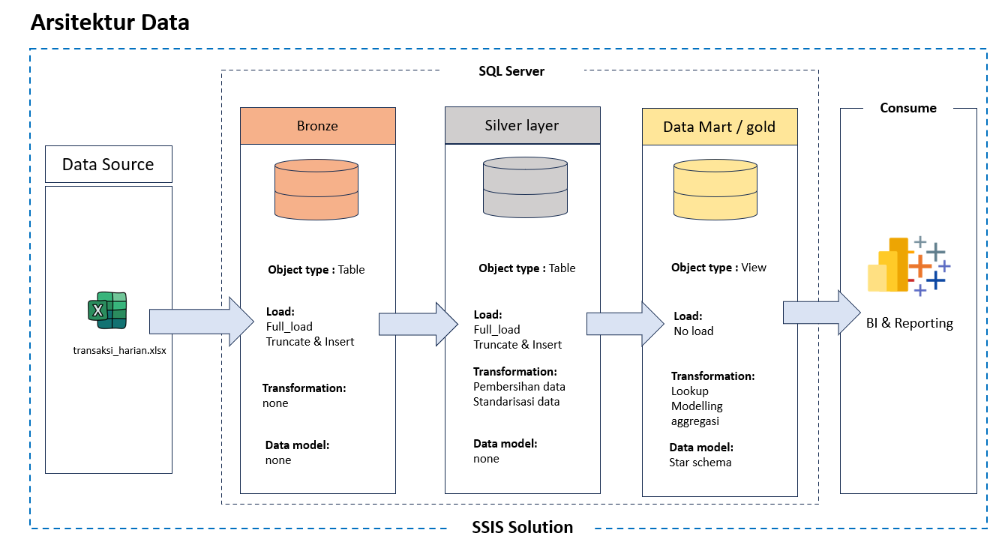

# etl-transaksi-banking-domain
Proyek ini mensimulasikan proses ETL end-to-end dan pemodelan data warehouse skala kecil (data mart)untuk domain perbankan, yang dibangun menggunakan Microsoft SSIS dan SQL Server. Kasus penggunaan dirancang untuk menyelaraskan dengan lingkungan yang melibatkan data keuangan yang teratur.

## 🗂️ Arsitektur Data

## 🧾 Deskripsi Proses ETL

1. **Load Bronze**
   - Mengambil data dari `transaksi.xlsx` (multi-channel).
   - Menyimpan ke tabel `bronze_transaksi` tanpa transformasi.
   - berbasis SSIS Data flow task

2. **Transform ke Silver**
   - Validasi data: pastikan format tanggal, jumlah angka valid.
   - Normalisasi: semua channel huruf besar, branch ID seragam.
   - Output ke `silver_transaksi`.
   - Berbasis Script yang dieksekusi menggunakan 'SSIS SQL execute task'

3. **Load ke Gold**
   - Membuat `dim_branch`, `dim_channel`, dan `fact_transaksi` via View.
   - Berbasis Script yang dieksekusi menggunakan 'SSIS SQL execute task'
     
4. **Quick Report**
   - Menghitung KPI dan key metrik eperti jumlah transaksi, frekuensi transaksi,
     rata-rata frekuensi transaksi dll.

## 📁 Struktur Proyek
     
     ├── data_source/
     │ └── transaksi.xlsx # Sample multi-channel source data
     │
     ├── doc/
     │ ├── FSD/
     │ │ └── Draft FSD.docx # Functional Specification
     │ └── TSD/
     │ ├── TSD.pdf # Technical Spec Document
     │ └── arsitektur-data.png # Diagram alur data
     │
     ├── output/
     │ ├── dim_branch.xlsx
     │ ├── dim_channel.xlsx
     │ └── fact_transaksi.xlsx # Export-an dari Gold layer
     │
     ├── scripts/
     │ ├── init_db.sql # Setup awal database
     │ ├── ddl_bronze.sql
     │ ├── ddl_silver.sql
     │ ├── ddl_gold(views).sql
     │ ├── gold_report_transaksi.sql # Query pelaporan transaksi
     │ └── load_silver.sql # Script yang di eksekusi dengan task 'script' pada SSIS
     │
     ├── ssis-package/
     │ ├── load_bronze.dtsx # Load raw dari Excel ke Bronze
     │ ├── load_silver.dtsx # Transformasi dari Bronze ke Silver
     │ ├── load_gold.dtsx # Incremental load dari Silver ke Gold
     │ └── quick_report.dtsx # Export Gold ke Excel
     │
     ├── LICENSE
     └── README.md

## 💾 Teknologi yang Digunakan

- SQL Server 
- SSMS (Sql Server Management Studio)
- SSIS (SQL Server Integration Services)
- Microsoft Excel
  
## 📎 Dokumen Terkait

- [📄 FSD - Functional Spec](doc/FSD/Draft%20FSD.docx)
- [📄 TSD - Technical Spec](doc/TSD/TSD.pdf)
- [🖼️ Data Architecture](doc/TSD/arsitektur-data.png)

# 👨‍💻 Author

**Afrijal Rasya**  
_ETL Development Enthusiast | Aspiring Data Engineer_  
📧 afrijalrasyap@gmail.com

  
## 📜 Lisensi

Proyek ini berada di bawah lisensi MIT.
